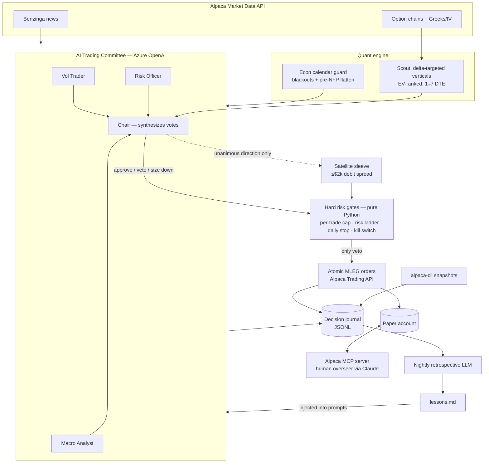

# 🐑 Theta Shepherd

An autonomous options premium-selling agent for the **Alpaca AI Trading Agents Hackathon**
(lablab.ai × Alpaca, Aug 28 – Sep 4 2026).

Theta Shepherd herds a flock of defined-risk credit spreads on liquid ETFs (SPY, QQQ):
a quantitative engine scouts delta-targeted verticals, an **AI Trading Committee**
(three Azure OpenAI personas — Macro Analyst, Vol Trader, Risk Officer — plus a Chair)
debates every candidate against live news and the macro calendar, and **hard-coded risk
gates** — which no LLM can override — make the final call before any order reaches
Alpaca's paper Trading API. Every night the shepherd re-reads its own journal and
writes lessons that change how the committee argues the next day.

## Architecture

```
       ┌─────────────────────────────────────────────────────────┐
       │                    run_agent.py (cycle)                 │
       └─────────────────────────────────────────────────────────┘
   1. reconcile      orders vs. broker state        (Trading API)
   2. manage exits   50% profit / 2x stop / expiry  (Options data + MLEG orders)
   3. guards         NFP flatten, kill switch,      (econ calendar + equity peak)
                     entry blackouts, risk ladder
   4. scout          delta-targeted credit spreads  (Option chains + Greeks)
   5. committee      3 AI personas debate, Chair    (news + macro calendar +
                     synthesizes the decision        lessons from prior days)
   6. risk gate      hard limits, can only veto     (pure Python, no LLM)
   7. execute        atomic multi-leg MLEG orders   (Trading API)
   8. journal        every decision → JSONL         (audit trail)
       + alpaca-cli account/positions snapshots each cycle
       + nightly retrospective: journal → lessons.md → tomorrow's prompts
```



| Module | Role |
|---|---|
| `theta_shepherd/strategy.py` | Builds 1–7 DTE vertical credit spreads (short strike at 0.12–0.25 delta, EV-ranked) and the satellite sleeve's directional debit spreads |
| `theta_shepherd/committee.py` | The Trading Committee: Macro Analyst, Vol Trader, Risk Officer vote independently; the Chair synthesizes. Full debate journaled |
| `theta_shepherd/retro.py` | Nightly retrospective: LLM distills the day's journal into `journal/lessons.md`, injected into the next day's committee prompts |
| `theta_shepherd/llm.py` | Shared Azure OpenAI plumbing + single-gatekeeper fallback |
| `theta_shepherd/risk.py` | Hard gates: per-trade risk cap, laddered portfolio risk cap ($4k base, +$2k per green day, $10k ceiling), daily loss limit, max open spreads |
| `theta_shepherd/econ_calendar.py` | Tier-1 macro calendar: entry blackouts around releases, mandatory pre-NFP flatten |
| `theta_shepherd/execution.py` | Atomic MLEG limit orders (negative limit = credit) via `alpaca-py` |
| `theta_shepherd/market.py` | Option chains with Greeks/IV, quotes, Benzinga news via Market Data API |
| `theta_shepherd/cli_ops.py` | `alpaca-cli` account & positions snapshots journaled every cycle |
| `theta_shepherd/journal.py` | Append-only JSONL decision journal + open-spread state |

## Setup

```powershell
# 1. Python deps (Python 3.12+)
uv venv .venv
uv pip install --python .venv\Scripts\python.exe -r requirements.txt

# 2. Alpaca CLI (needs Python 3.14 — uv handles it)
uv tool install alpaca-cli --python 3.14

# 3. Credentials
copy .env.example .env      # then fill in Alpaca + Azure OpenAI keys
```

**Alpaca account:** create a paper account, set the starting balance to **$100,000**
(hackathon requirement: a brand-new account for the final submission), and make sure
options trading is enabled at **Level 3** (needed for spreads) in the paper account
settings. Generate API keys from the dashboard.

The `alpaca-cli` reads the same keys — run `alpaca-cli config verify` once to confirm.

### MCP server — the human overseer's window

The CLI is the agent's hands; **MCP is the human's window into the same account.**
Register [Alpaca's official MCP server](https://github.com/alpacahq/alpaca-mcp-server)
with Claude (or any MCP client) and ask it things like *"how is the flock doing?"*
while the agent trades:

```bash
claude mcp add alpaca --transport stdio -- uvx alpaca-mcp-server --env-file /path/to/.env
```

(or copy `.mcp.json.example` into your client's MCP config and fill in the keys).

## Running

```powershell
.\.venv\Scripts\python.exe run_agent.py --scout    # dry run: show ranked candidates
.\.venv\Scripts\python.exe run_agent.py            # one full decision cycle
.\.venv\Scripts\python.exe run_agent.py --loop     # continuous, one cycle / 30 min
.\.venv\Scripts\python.exe run_agent.py --retro    # nightly: journal → lessons.md
.\.venv\Scripts\python.exe run_agent.py --flatten  # close everything now
python -m pytest tests/                            # 48 tests, no network needed
```

To run unattended on Windows, register the two scheduled tasks (paths are in the
committed `scheduler_*.bat` wrappers — adjust to your checkout):

```powershell
# a decision cycle every 20 min during the US session (agent no-ops when closed)
schtasks /create /tn "ThetaShepherd Cycle" /tr "C:\path\to\scheduler_cycle.bat" `
  /sc weekly /d MON,TUE,WED,THU,FRI /st 19:00 /ri 20 /du 06:30
# the nightly retrospective shortly after the close
schtasks /create /tn "ThetaShepherd Retro" /tr "C:\path\to\scheduler_retro.bat" `
  /sc weekly /d TUE,WED,THU,FRI,SAT /st 01:45
```

## Strategy in one paragraph

Sell out-of-the-money vertical credit spreads (put side and call side; both sides on
one expiry form an iron condor) on SPY/QQQ at 1–7 days to expiry, short strike in the
0.12–0.25 delta band, $5 wide, only when the credit is ≥ 15% of width. Exit at 50% of
max profit, stop out if the spread doubles against us, and never hold to same-day
expiration. The committee decides *whether* and *which* — the risk gates decide *how
much* and *whether it's allowed at all*.

One creative wrinkle: the **satellite sleeve**. When — and only when — all three
committee personas independently call the same market direction, the agent may buy a
single near-the-money debit spread (≤ $2k total risk, one at a time, +50% target /
−50% stop, never held into the last day). Unanimity among adversarial personas is
rare by design; conviction is the scarce resource being spent.

## Journal

Every cycle appends structured events (`committee_debate`, `order_submitted`,
`spread_closed`, `risk_veto`, `risk_ladder`, …) to `journal/YYYY-MM-DD.jsonl` —
the full audit trail of what the agent saw, argued about, and did. After each
session the retrospective distills that day into `journal/lessons.md`, which the
committee reads the next morning: **the shepherd provably learns across the week.**
